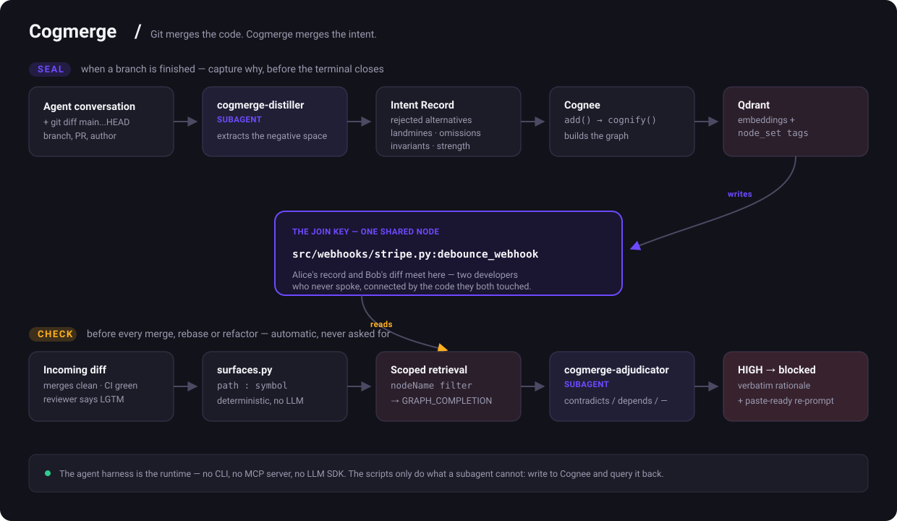

<h1 align="center">Cogmerge</h1>

<p align="center"><strong>Git merges the code. Cogmerge merges the intent.</strong></p>

<p align="center">
  
  
  
  <br>
  
  
  
</p>

<p align="center">
Cogmerge captures <em>why</em> your team made the decisions they made — the alternatives
they rejected, the code that looks dead but isn't, the questions they answered along the
way — and gives it back to whoever needs it next. It stops an agent from silently undoing
a deliberate choice at merge time, and it tells <em>you</em> why the code is the way it is
while you're still deciding what to build.
</p>

---

## The problem

Your agent's conversation is deleted when you close the terminal. That conversation
held the only record of **why**.

```
Alice, PR #121   Adds debounce_webhook(). Tells her agent why:
                 "Stripe caps us at 25 req/s. I rejected a Redis queue —
                  extra failure mode, no monitoring. No test, because
                  reproducing it needs a live rate limit. Don't remove this."
                 Then she closes the terminal. The conversation is gone.

Bob, PR #128     Asks his agent to clean up the webhook module.
                 His agent sees an untested no-op wrapper. It inlines it away.

git merge        clean. No conflict. Not even a nearby line.
CI               green. Nothing tested it, by design.
AI reviewer      "LGTM, nice simplification."
production       429s from Stripe, next Tuesday.
```

Nothing in that chain is broken. Git diffed text correctly. CI ran what exists.
Both agents behaved reasonably given their inputs. **It failed because the only
input that mattered was thrown away when Alice closed her terminal.**

Everything Git preserves is a record of what **exists**. Every high-value piece of
engineering context is a record of what **doesn't** — the alternative you rejected,
the test you deliberately didn't write, the wrapper that looks dead but is a rate
limit. None of it has anywhere to live, so an agent asked to merge infers intent
from syntax. Inferred intent is a hallucination with a clean diff attached.

## The solution

Git indexes code by *file*. Cogmerge indexes **reasoning by code surface** — so the
moment an agent touches `src/webhooks/stripe.py:debounce_webhook`, every decision
anyone made about that exact symbol, **including the ones they decided against**, is
one hop away.

<p align="center"></p>

**SEAL** — when a branch is finished, the `cogmerge-distiller` subagent reads the
conversation and the diff and extracts the *negative space*: rejected alternatives,
landmines, deliberate omissions, invariants. It never restates the diff — if the
diff shows it, it is not intent. The record goes into Cognee tagged
`surface:path:symbol`, embedded in Qdrant.

**CHECK** — before any merge, the diff is reduced to surfaces deterministically (no
LLM), those surfaces become a `node_set` filter so retrieval stays scoped as the
repo grows, and graph completion runs over that slice. The `cogmerge-adjudicator`
subagent rules on each record — `contradicts`, `depends_on`, or `unrelated`. A HIGH
finding blocks the merge and returns the original author's verbatim rationale plus a
paste-ready re-prompt.

**The surface tag is the join key.** Alice's record and Bob's diff meet on the one
symbol they both touched — two developers who never spoke, connected by the code.

**The agent harness is the runtime.** No CLI, no MCP server, no LLM SDK, no daemon.
Your agent reads `AGENTS.md`, two subagents do the reasoning, and the scripts only do
what a subagent cannot: write to Cognee and query it back.

## It's for the humans too

Blocking bad merges is the sharp edge. The bigger everyday use is **understanding
your teammates' reasoning while you build**, not after you break something.

Ask about any file or symbol and get the team's history of *why*:

```bash
python3 .claude/skills/cogmerge/scripts/check.py --files src/webhooks/stripe.py
```
```
Decision   Debounce in-process instead of queueing        — alice, PR #121
           "A Redis queue would work but adds a failure mode we have no
            monitoring for yet."
           Rejected: Redis queue · raising the Stripe rate limit

Q&A        "Should the debounce be per-account or global?"
           "Per-account. A global debounce would throttle tenants who are
            nowhere near the limit."
```

That changes how a feature gets built, not just how it gets merged:

- **You stop re-litigating settled decisions.** The Redis queue was already
  considered and rejected for a stated reason. You either have new information
  that reverses it, or you move on — but you're never the third person to
  independently rediscover it.
- **You inherit the constraints, not just the code.** Reading a file tells you
  what it does. Cogmerge tells you which parts are load-bearing, which gaps are
  deliberate, and what breaks if you're clever.
- **Onboarding stops being a queue of DMs.** A new joiner asks the codebase
  directly, and gets answers in the words of whoever actually decided.
- **Questions your agent asked get reused.** When Claude stops and asks *"per
  account or global?"*, that marks a **proven ambiguity** — the code wasn't clear
  enough to proceed. Your answer is stored, so the next person hitting the same
  confusion finds it already resolved, rather than asking in Slack and waiting.

Same index, two audiences: the agent reads it before a merge, you read it before
you commit to an approach. It is the team's answer to *"why is it like this?"* —
which today lives in the heads of whoever happens to still work here.

### Ask from Slack

Most people won't run a CLI to satisfy a passing "huh, why is this here?" — so the
same memory is one slash command away:

```
/cogmerge src/webhooks/stripe.py
/cogmerge why do we debounce the stripe webhook?
/cogmerge is debounce_webhook safe to remove?
```

Setup is a manifest paste and two tokens — see [`slack/README.md`](slack/README.md).
It runs in **Socket Mode**, so there's no public URL and no ngrok tunnel to keep
alive. It reads memory only; sealing stays in the editor, where the conversation
and the diff actually are.

## Get started

Run this in your repository:

```bash
curl -fsSL https://raw.githubusercontent.com/peresramirez/Cogmerge/main/install.sh | bash
```

It installs the skill and subagents for **both** Claude Code and Cursor, writes
`AGENTS.md`, and adds `.env` to your `.gitignore`. Nothing to compile, no service to
run, no dependencies — Python 3.9+ stdlib only.

```bash
curl ... | bash -s -- --claude    # Claude Code only
curl ... | bash -s -- --cursor    # Cursor only
```

Then configure and verify:

```bash
cp .env.example .env              # fill it in, see below
python3 .claude/skills/cogmerge/scripts/smoke.py    # must print OK
```

That's it. Work normally — your agent checks before it merges, and offers to seal
when you finish a branch.

Uninstall is `rm -rf .claude/skills/cogmerge .cursor/skills/cogmerge`.

## Configure `.env`

Cogmerge talks to Cognee one of two ways. Pick one.

### Option A — Cognee Cloud (default, nothing to install)

Cognee runs the extraction server-side, so you need no LLM key of your own.

```dotenv
COGMERGE_BACKEND=cloud
COGMERGE_REPO=your-org/your-repo        # scopes every memory tag

COGNEE_BASE_URL=https://tenant-<your-tenant-id>.aws.cognee.ai
COGNEE_API_KEY=<your-cognee-api-key>
COGNEE_TENANT_ID=<your-tenant-id>
```

### Option B — your own Qdrant cluster

Runs the `cognee` library locally so the collections appear in **your** Qdrant
dashboard. Needs `pip install cognee cognee-community-vector-adapter-qdrant` and
your own OpenAI key.

```dotenv
COGMERGE_BACKEND=qdrant
COGMERGE_REPO=your-org/your-repo

QDRANT_API_URL=https://<cluster-id>.<region>.aws.cloud.qdrant.io:6333
QDRANT_API_KEY=<your-qdrant-api-key>
VECTOR_DB_PROVIDER=qdrant
VECTOR_DATASET_DATABASE_HANDLER=qdrant

LLM_API_KEY=sk-...                      # embeddings + graph extraction
```

Three things that will bite you on Option B, all learned the hard way:

1. **Run `init_qdrant.py` once after your first seal.** Cogmerge filters every
   lookup by `node_set`, and Qdrant refuses to filter an unindexed payload field.
   The adapter creates the collections but not the index, and it fails **soft** —
   you get "no prior intent recorded" instead of an error. A false all-clear is the
   one failure mode this tool must never have.
   ```bash
   python3 .claude/skills/cogmerge/scripts/init_qdrant.py
   ```
2. **The cluster URL needs the `:6333` port.** The Qdrant dashboard shows it without.
3. **`cognee` requires Python `>=3.10,<3.14`.** It will not install on 3.14 — use a
   venv on 3.11 or 3.13 if your system Python is newer.

## Works with

One copy serves both editors — Cursor reads Claude's directories natively, and the
`.cursor/` tree is generated from `.claude/` so they cannot drift.

| | Claude Code | Cursor |
|---|---|---|
| `AGENTS.md` | via `CLAUDE.md` → `@AGENTS.md` | native |
| skill | `.claude/skills/cogmerge/` | `.cursor/skills/cogmerge/` |
| subagents | `.claude/agents/` | `.cursor/agents/` |
| always-on rule | — | `.cursor/rules/cogmerge.mdc` |

Cursor gets a rule *and* a skill on purpose: skills are **agent-decided** — the model
judges whether they're relevant — while `alwaysApply: true` is unconditional. For
"never merge without checking first," you don't want the model deciding whether the
rule applies. That judgement is exactly what Cogmerge exists to distrust.

Contributors: `.claude/` is the source of truth. Run `bash tools/sync-cursor.sh`
after editing it, and `--check` to verify.

## Layout

```
AGENTS.md                       the behavioural contract both editors read
install.sh                      one-command install into any repo
.claude/
  agents/                       cogmerge-distiller, cogmerge-adjudicator
  skills/cogmerge/
    SKILL.md                    when and how to seal / check
    references/                 the JSON contract the distiller emits
    scripts/backend.py          the only thing that talks to Cognee
    scripts/seal.py             write one intent record
    scripts/check.py            retrieve intent for a pending diff
    scripts/surfaces.py         git diff -> path / path:symbol
    scripts/init_qdrant.py      one-time payload index (Qdrant only)
.cursor/                        generated from .claude/ by tools/sync-cursor.sh
slack/                          optional bot: /cogmerge in any channel
docs/                           PROBLEM, SOLUTION, BRAND
```

## Why not a markdown file

| | `DECISIONS.md` | Cogmerge |
|---|---|---|
| Retrieve by code surface | `grep` | graph traversal from a shared surface node |
| Bigger than a context window | breaks | top-k, only the relevant records load |
| Scoped by who may see what | impossible | `node_set` + Cognee datasets |
| Connects two people who never spoke | impossible | they share the surface node |
| Updated at merge time | never happens | it *is* the merge-time step |

Full reasoning in [`docs/PROBLEM.md`](docs/PROBLEM.md) and [`docs/SOLUTION.md`](docs/SOLUTION.md).
